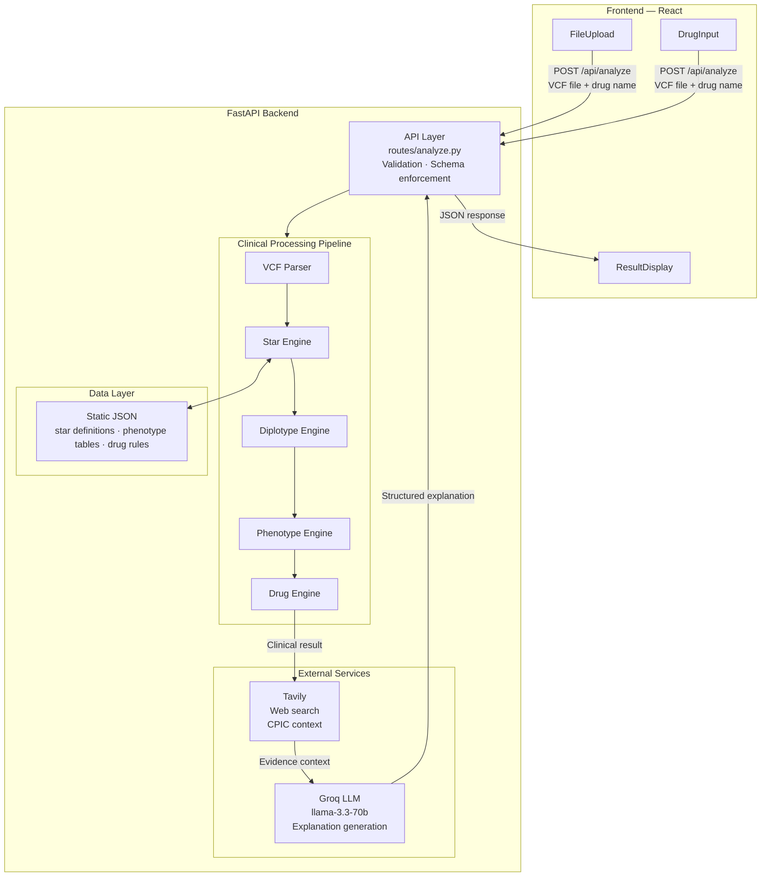

# PharmaGuard

[](https://opensource.org/licenses/MIT)
[](https://www.python.org/downloads/)
[](https://reactjs.org/)
[](https://fastapi.tiangolo.com/)

A pharmacogenomics web application that analyzes a patient's VCF file and returns personalized drug safety recommendations based on their genetic variants. It identifies variants across six clinically significant genes, determines metabolizer phenotypes using CPIC guidelines, and produces structured risk assessments with AI-generated clinical explanations.

**Live Application:** [Add your deployed URL here]

---

## How It Works

The analysis pipeline runs in a fixed, deterministic sequence. The LLM is strictly isolated to explanation generation — it never influences the clinical decision.



### Processing Steps

1. **VCF Parsing** — Variants are extracted for the six target genes by reading the `GENE`, `RS`, and `STAR` INFO tags from each record.
2. **Star Allele Matching** — Each variant's rsID and ALT allele are matched against `star_definitions.json`. The INFO `STAR` tag is used directly if present; otherwise the most specific matching allele wins. Defaults to `*1` if no match is found.
3. **Diplotype Formation** — Genotype patterns (`0/0`, `0/1`, `1/1`) are used to determine whether the allele is homozygous or heterozygous, forming the final diplotype string.
4. **Phenotype Determination** — CYP2D6 uses an activity score model (sum of per-allele scores with CPIC thresholds). All other genes use a direct diplotype-to-phenotype lookup table.
5. **Drug Risk Assessment** — The phenotype is matched against `drug_rules.json` to produce a deterministic `risk_label`, `severity`, and recommendation text.
6. **Explanation Generation** — Tavily fetches recent pharmacogenomics literature as context. Groq LLM generates the mechanism, clinical context, and patient-friendly summary. If either service is unavailable, fallback templates are used.

The gene profile is built once per request and reused across all drugs in a multi-drug analysis.

---

## Supported Genes and Drugs

| Drug | Gene | Indication |
|---|---|---|
| Codeine | CYP2D6 | Pain |
| Tramadol | CYP2D6 | Pain |
| Clopidogrel | CYP2C19 | Antiplatelet |
| Escitalopram | CYP2C19 | Antidepressant |
| Warfarin | CYP2C9 | Anticoagulation |
| Phenytoin | CYP2C9 | Antiepileptic |
| Simvastatin | SLCO1B1 | Cholesterol |
| Atorvastatin | SLCO1B1 | Cholesterol |
| Azathioprine | TPMT | Immunosuppression |
| Mercaptopurine | TPMT | Oncology |
| Fluorouracil | DPYD | Chemotherapy |
| Capecitabine | DPYD | Chemotherapy |

Phenotype classifications follow CPIC conventions: **PM** (Poor), **IM** (Intermediate), **NM** (Normal), **RM** (Rapid), **URM** (Ultrarapid) Metabolizer.

---

## Setup

### Prerequisites

- Python 3.8+
- Node.js 16+

### Backend

```bash
cd backend
python -m venv venv
source venv/bin/activate   # Windows: venv\Scripts\activate
pip install -r requirements.txt
```

Create a `.env` file in `backend/`:

```env
GROQ_API_KEY=your_key_here      # free at console.groq.com
TAVILY_API_KEY=your_key_here    # free at tavily.com — optional, enables web search
PORT=8000
CORS_ORIGINS=http://localhost:3000
```

```bash
python main.py
# API running at http://localhost:8000
```

### Frontend

```bash
cd frontend
npm install
npm start
# App running at http://localhost:3000
```

---

## Testing

A sample VCF file with variants across all six genes is included at `backend/sample_vcf/sample_patient.vcf`.

1. Start the backend and frontend.
2. Upload `sample_patient.vcf`.
3. Search for and select a drug (e.g. `clopidogrel`).
4. Click **Run Pharmacogenomic Analysis**.

---

## Project Structure

```
PharmaGuard/
├── backend/
│   ├── main.py                     # FastAPI app, CORS, router registration
│   ├── requirements.txt
│   ├── routes/
│   │   └── analyze.py              # POST /api/analyze — orchestrates the full pipeline
│   ├── services/
│   │   ├── vcf_parser.py           # VCF parsing and variant extraction
│   │   ├── star_engine.py          # Star allele matching against definitions
│   │   ├── diplotype_engine.py     # Diplotype formation from genotype patterns
│   │   ├── phenotype_engine.py     # Phenotype determination (activity score + table lookup)
│   │   ├── drug_engine.py          # Deterministic drug risk rules
│   │   ├── llm_service.py          # Groq LLM explanation generation
│   │   └── web_search_service.py   # Tavily-based context retrieval
│   ├── schemas/
│   │   └── response_schema.py      # Pydantic v2 response models
│   ├── data/
│   │   ├── star_definitions.json   # rsID + ALT definitions per star allele
│   │   ├── phenotype_tables.json   # Diplotype → phenotype tables + CYP2D6 activity scores
│   │   └── drug_rules.json         # Phenotype → risk label, severity, recommendation
│   └── sample_vcf/
│       └── sample_patient.vcf
├── frontend/
│   └── src/
│       ├── App.js                  # State management, Axios submission
│       └── components/
│           ├── FileUpload.js       # Drag-and-drop VCF upload with validation
│           ├── DrugInput.js        # Searchable multi-select drug picker
│           ├── ResultDisplay.js    # Risk card, gene accordion, JSON export
│           └── ErrorBanner.js      # Dismissible error display
└── docs/
```

---

## API

### `POST /api/analyze`

Accepts `multipart/form-data` with:
- `file` — a `.vcf` file (max 5 MB, UTF-8, must include `##fileformat=VCF` header)
- `drug` — a single drug name or comma-separated list

Returns a JSON array — one `AnalysisResponse` object per drug — each containing:
- `risk_assessment` — `risk_label`, `severity`, `confidence_score`
- `pharmacogenomic_profile` — diplotype, phenotype, and detected variants for all six genes
- `clinical_recommendation` — summary, dosing guidance, monitoring requirements
- `llm_generated_explanation` — mechanism, clinical context, patient-friendly summary
- `quality_metrics` — boolean flags for each pipeline stage

### `GET /health`

Returns `{ "status": "healthy" }`.

---

## Deployment

**Backend** (Railway, Render, or any platform supporting Python):
```bash
uvicorn main:app --host 0.0.0.0 --port $PORT
```
Set `GROQ_API_KEY` and `CORS_ORIGINS` in the platform's environment variables.

**Frontend** (Vercel, Netlify):
```bash
npm run build
```
Set `REACT_APP_API_URL` to your backend's public URL before building.

---

## Acknowledgments

- [CPIC](https://cpicpgx.org) — Clinical Pharmacogenetics Implementation Consortium guidelines
- [PharmVar](https://www.pharmvar.org) — Pharmacogene Variation Consortium allele definitions
- [Groq](https://console.groq.com) — LLM inference
- [Tavily](https://tavily.com) — Web search API

---

*Built for RIFT Hackathon 2026. This tool is for research and educational purposes only. Always consult a qualified healthcare professional for medical decisions.*

