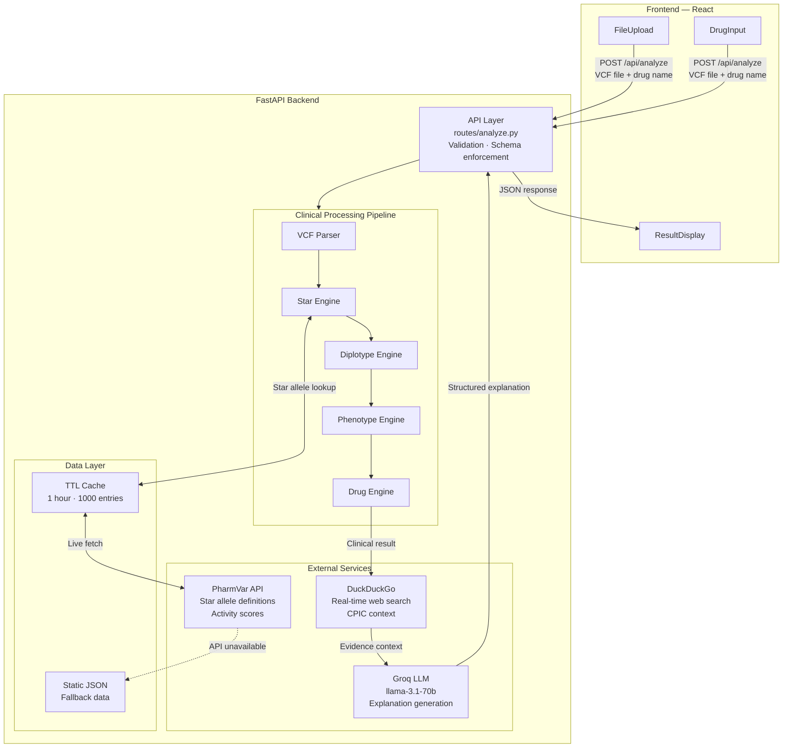

# PharmaGuard - Pharmacogenomics Analysis Platform

[](https://opensource.org/licenses/MIT)
[](https://www.python.org/downloads/)
[](https://reactjs.org/)
[](https://fastapi.tiangolo.com/)

## Overview

**PharmaGuard** is a production-grade pharmacogenomics web application that analyzes VCF files to provide personalized drug safety recommendations based on genetic variants. It identifies pharmacogenomic variants in key genes (CYP2D6, CYP2C19, CYP2C9, SLCO1B1, TPMT, DPYD), determines phenotypes using CPIC guidelines, and delivers drug-specific risk assessments with LLM-generated explanations.

## Live Demo

**Live Application:** [Add your deployed URL here]

**Demo Video (LinkedIn):** [Add your LinkedIn video link here]

---

## System Architecture



### Key Design Principles

1. **Dynamic Data Fetching**: Real-time PharmVar API calls for latest variant data
2. **Modular Architecture**: Each service has single responsibility
3. **Web-Augmented Intelligence**: LLM enriched with contextual research
4. **Hybrid Data Strategy**: API-first with static JSON fallback for 100% uptime
5. **Schema Validation**: Strict Pydantic models ensure exact field matching
6. **Free-Tier APIs**: Zero cost architecture using Groq, PharmVar, DuckDuckGo
7. **Graceful Degradation**: Failover to static data if APIs unavailable

### API Integration Benefits

| Feature | Before (Static) | After (API Integration) |
|---------|----------------|-------------------------|
| Data Updates | Manual | Automatic from PharmVar |
| LLM Cost | OpenAI ($$$) | Groq (Free) |
| Context | Limited | Web search enriched |
| Allele Coverage | Pre-defined | All current PharmVar alleles |
| Evidence Base | Static guidelines | Real-time research |
| Maintenance | High | Minimal |

---

## Supported Genes & Drugs

### Genes Analyzed
- **CYP2D6** - Activity score model
- **CYP2C19** - Diplotype-phenotype mapping
- **CYP2C9** - Diplotype-phenotype mapping
- **SLCO1B1** - Statin transporter
- **TPMT** - Thiopurine metabolism
- **DPYD** - Fluoropyrimidine metabolism

### Supported Drugs (12)
| Drug | Gene | Use Case |
|------|------|----------|
| Codeine | CYP2D6 | Pain management |
| Tramadol | CYP2D6 | Pain management |
| Clopidogrel | CYP2C19 | Antiplatelet therapy |
| Escitalopram | CYP2C19 | Antidepressant |
| Warfarin | CYP2C9 | Anticoagulation |
| Phenytoin | CYP2C9 | Antiepileptic |
| Simvastatin | SLCO1B1 | Cholesterol management |
| Atorvastatin | SLCO1B1 | Cholesterol management |
| Azathioprine | TPMT | Immunosuppression |
| Mercaptopurine | TPMT | Cancer treatment |
| Fluorouracil | DPYD | Chemotherapy |
| Capecitabine | DPYD | Chemotherapy |

---

## Installation & Setup

### Prerequisites
- Python 3.8+
- Node.js 16+
- OpenAI API key (optional, for LLM explanations)

### Backend Setup

```bash
# Navigate to backend directory
cd backend

# Create virtual environment
python -m venv venv

# Activate virtual environment
# Windows:
venv\Scripts\activate
# Linux/Mac:
source venv/bin/activate

# Install dependencies
pip install -r requirements.txt

# Configure environment variables
cp .env.example .env
# Edit .env and add your GROQ_API_KEY (free from console.groq.com)

# Run the server
python main.py
```

Backend will start at `http://localhost:8000`

**Get Groq API Key (Free):**
1. Visit https://console.groq.com
2. Sign up (free, no credit card)
3. Go to API Keys → Create new key
4. Add to `.env`: `GROQ_API_KEY=your_key_here`

### Frontend Setup

```bash
# Navigate to frontend directory
cd frontend

# Install dependencies
npm install

# Configure environment
cp .env.example .env
# Edit .env if backend URL is different

# Start development server
npm start
```

Frontend will start at `http://localhost:3000`

---

## API Integration

PharmaGuard leverages **three free APIs** for dynamic, real-time analysis:

1. **PharmVar API** - Authoritative pharmacogene variant data (no key required)
2. **Groq LLM** - Fast, free LLM inference with llama-3.1-70b (free tier)
3. **DuckDuckGo Search** - Web search for contextual research (no key required)

**Total Cost**: $0/month

See [API_INTEGRATION.md](API_INTEGRATION.md) for detailed architecture.

---

## API Documentation

### Endpoint: `POST /api/analyze`

**Request:**
```
Content-Type: multipart/form-data

file: <VCF file> (.vcf, max 5MB)
drug: <drug name> (lowercase string)
```

**Response:** (200 OK)
```json
{
  "patient_id": "uuid-string",
  "drug": "string",
  "timestamp": "YYYY-MM-DDTHH:MM:SSZ",
  "risk_assessment": {
    "risk_label": "Safe|Adjust Dosage|Toxic|Ineffective|Unknown",
    "severity": "none|low|moderate|high|critical",
    "confidence_score": 0.0-1.0
  },
  "pharmacogenomic_profile": [
    {
      "gene": "string",
      "star_allele_1": "string",
      "star_allele_2": "string",
      "diplotype": "string",
      "phenotype": "PM|IM|NM|RM|URM|Unknown",
      "detected_variants": [...]
    }
  ],
  "clinical_recommendation": {
    "summary": "string",
    "dosing_guidance": "string",
    "monitoring_requirements": "string"
  },
  "llm_generated_explanation": {
    "mechanism": "string",
    "clinical_context": "string",
    "patient_friendly_summary": "string"
  },
  "quality_metrics": {
    "vcf_parsing_success": true,
    "gene_variants_found": true,
    "star_allele_determined": true,
    "phenotype_determined": true,
    "recommendation_generated": true,
    "llm_explanation_generated": true
  }
}
```

**Error Response:** (400/500)
```json
{
  "error": {
    "code": "string",
    "message": "string",
    "details": "string"
  }
}
```

### Additional Endpoints

- `GET /` - Root endpoint with API info
- `GET /health` - Health check endpoint

---

## Project Structure

```
PharmaGuard/
├── backend/
│   ├── main.py                 # FastAPI application
│   ├── requirements.txt        # Python dependencies
│   ├── .env.example           # Environment template
│   ├── routes/
│   │   └── analyze.py         # Analysis endpoint
│   ├── services/
│   │   ├── vcf_parser.py      # VCF parsing
│   │   ├── star_engine.py     # Star allele matching
│   │   ├── diplotype_engine.py # Diplotype formation
│   │   ├── phenotype_engine.py # Phenotype determination
│   │   ├── drug_engine.py     # Drug recommendations
│   │   └── llm_service.py     # LLM explanations
│   ├── schemas/
│   │   └── response_schema.py # Pydantic models
│   ├── data/
│   │   ├── star_definitions.json
│   │   ├── phenotype_tables.json
│   │   └── drug_rules.json
│   └── sample_vcf/
│       └── sample_patient.vcf
├── frontend/
│   ├── package.json
│   ├── tailwind.config.js
│   ├── public/
│   │   └── index.html
│   └── src/
│       ├── App.js             # Main application
│       ├── index.js           # Entry point
│       ├── index.css          # Global styles
│       └── components/
│           ├── FileUpload.js
│           ├── DrugInput.js
│           ├── ResultDisplay.js
│           └── ErrorBanner.js
└── README.md
```

---

## Sample VCF File

A sample VCF file is provided in `backend/sample_vcf/sample_patient.vcf` for testing. It contains variants in all 6 supported genes.

**Test the system:**
1. Start both backend and frontend
2. Upload `sample_patient.vcf`
3. Select drug: "clopidogrel"
4. View personalized recommendations

---

## Clinical Decision Logic

### Step-by-Step Processing

1. **VCF Parsing**
   - Extract variants for 6 genes
   - Parse INFO tags (GENE, RS, STAR)
   - Validate genotype format

2. **Star Allele Determination**
   - Match rsID + alt allele to definitions
   - Use INFO STAR tag if present
   - Default to *1 if no variants

3. **Diplotype Formation**
   - Analyze genotype patterns (0/0, 0/1, 1/1)
   - Form diplotype based on detected alleles
   - Handle ambiguous cases gracefully

4. **Phenotype Determination**
   - CYP2D6: Activity score model
   - Others: Direct diplotype → phenotype mapping
   - CPIC guidelines implementation

5. **Drug Risk Assessment**
   - Deterministic phenotype + drug rules
   - No LLM involvement in clinical decisions
   - Confidence scoring based on evidence

6. **LLM Explanation**
   - Isolated to explanation generation
   - Fallback to templates if LLM fails
   - Validates JSON structure before returning

---

## Frontend Features

- **Drag & Drop Upload** with file size validation
- **Smart Drug Search** with autocomplete
- **Color-Coded Risk Display**
  - Green: Safe
  - Yellow: Adjust Dosage
  - Red: Toxic/Ineffective
- **Expandable Gene Profiles** with variant details
- **Copy/Download JSON** functionality
- **Quality Metrics Dashboard**
- **User-Friendly Error Messages**

---

## Edge Cases Handled

1. **No gene variants** → Assume *1/*1 (reference)
2. **Unknown star allele** → Phenotype = Unknown
3. **Ambiguous multi-variant** → Phenotype = Unknown
4. **Unsupported drug** → Risk = Unknown
5. **Missing genotype (GT)** → Skip variant
6. **LLM failure** → Fallback explanation
7. **Invalid VCF format** → User-friendly error
8. **File size exceeded** → Clear size limit message

---

## Quality Metrics

Every analysis includes quality metrics:
- `vcf_parsing_success` - File parsed successfully
- `gene_variants_found` - Variants detected
- `star_allele_determined` - Alleles matched
- `phenotype_determined` - Phenotype assigned
- `recommendation_generated` - Clinical rule applied
- `llm_explanation_generated` - Explanation created

---

## Configuration

### Backend Environment Variables
```env
GROQ_API_KEY=your_groq_key_here  # Free from console.groq.com
PORT=8000
CORS_ORIGINS=http://localhost:3000
```

### Frontend Environment Variables
```env
REACT_APP_API_URL=http://localhost:8000
```

### API Rate Limits
- **PharmVar**: 2 requests/second (managed by built-in rate limiter)
- **Groq**: 30 requests/minute (free tier)
- **DuckDuckGo**: ~100 searches/minute

See [API_INTEGRATION.md](API_INTEGRATION.md) for caching and optimization strategies.

---

## Deployment

### Backend (Recommended: Railway, Render, AWS)
1. Ensure CORS_ORIGINS includes production URL
2. Set GROQ_API_KEY in environment (free from console.groq.com)
3. Deploy with `uvicorn main:app --host 0.0.0.0 --port $PORT`
4. PharmVar and DuckDuckGo require no API keys

### Frontend (Recommended: Vercel, Netlify)
1. Update REACT_APP_API_URL to backend URL
2. Build: `npm run build`
3. Deploy `build/` directory

See [DEPLOYMENT.md](DEPLOYMENT.md) for detailed deployment guide.

---

## Team

**[Add your team member names and roles here]**

- Developer 1 - Backend Architecture
- Developer 2 - Frontend Development
- Developer 3 - Data Integration

---

## License

This project is for educational and hackathon purposes. Always consult healthcare professionals for medical decisions.

---

## Acknowledgments

- **CPIC** - Clinical Pharmacogenetics Implementation Consortium
- **PharmVar** - Pharmacogene Variation Consortium (API integration)
- **Groq** - Fast, free LLM inference
- **DuckDuckGo** - Privacy-focused web search

---

## Future Enhancements

**Completed:**
- Dynamic PharmVar API integration
- Real-time web search augmentation
- Free-tier LLM (Groq)
- Hybrid data strategy with fallback
- TTL caching for performance

**Roadmap:**

1. **PharmGKB API Integration**
   - Direct CPIC guideline fetching
   - Drug-drug interaction warnings
   - Clinical annotation enrichment

2. **ClinVar Integration**
   - Variant pathogenicity scoring
   - Clinical significance validation
   - Population frequency data

3. **Enhanced Caching**
   - Redis for distributed caching
   - Cross-instance cache sharing
   - Persistent cache storage

4. **Multi-LLM Support**
   - OpenAI fallback option
   - Anthropic Claude integration
   - Model selection per request

5. **Admin Dashboard**
   - API usage monitoring
   - Cache hit rate analytics
   - Error tracking dashboard

**Extensibility Design:**

If CPIC updates guidelines:
1. **No Code Changes** - PharmVar API automatically reflects updates
2. **Static Fallback** - Update `data/*.json` files as needed
3. **Versioning** - Consider `?api_version=2024` parameter

---

## Support

For questions or issues:
- Open an issue in the repository
- Contact: [Add your contact info]

---

**Built with love for RIFT Hackathon 2026**
